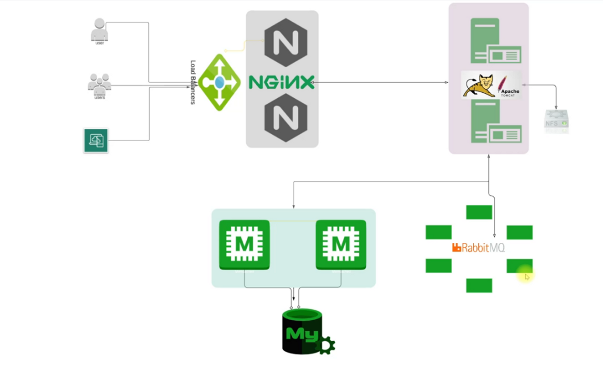
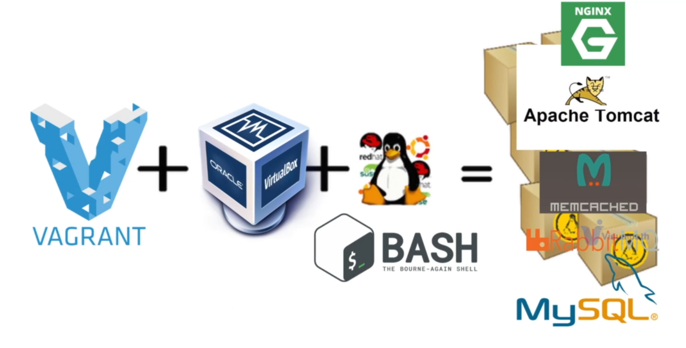

# Multi_Tier_Web_Application_Setup_Locally

## About the Project
- Multi Tier Web Application Stack. 
- Setup on Laptop/Desktop. 
- Baseline for Upcoming Projects.
- Helps you setup any project locally.

## Problem
- Not comfortable in making changes in real servers.
- Local setup is complex.
- Time consuming.
- Not repeatable.

## Solution
- Automated
- Repeatable
- Code (IAAC)

## Tools
- Hypervison (Oracle VM virtualbox)
- Automation (Vagrant)
- CLI (Git Bash or Powershell)
- IDE (VS code)

## Architecture of Project Services
- NGINX
- TOMCAT
- RABBITMQ
- MEMCACHED
- MYSQL

## Architecture of Automated Setup

	

